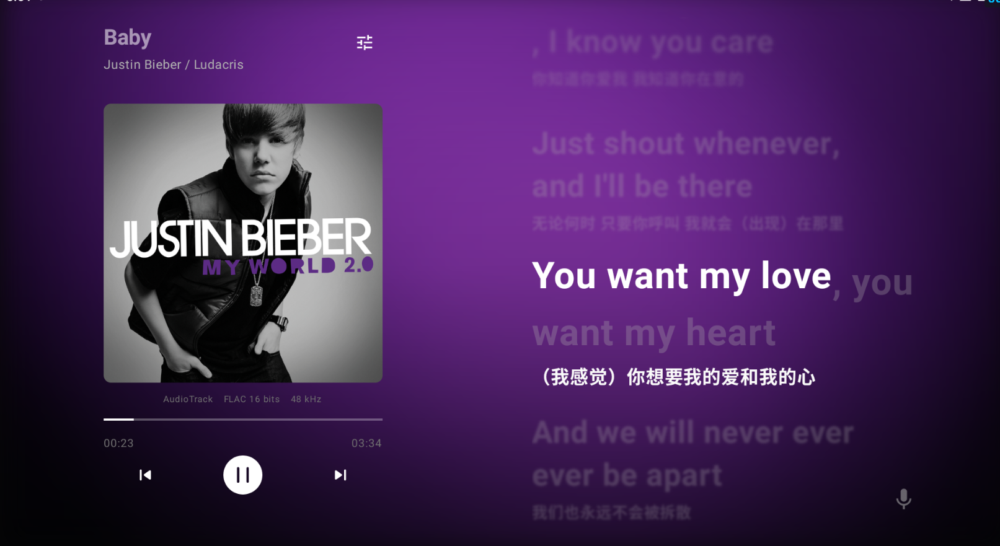

# BetterNCM-Android

一个受 BetterNCM 启发的网易云音乐第三方 Android 播放器 ·
A NetEase Cloud Music third-party Android player inspired by BetterNCM

> A buttery-smooth, high-resolution dynamic-lyrics experience built on the NetEase Cloud Music API.
>
> 个人学习与研究所用 · Not affiliated with NetEase or BetterNCM

---

## Language / 语言

**中文**：[简体中文](#简体中文) ｜ **English**: [English](#english)

---

## English

> **BNA** is a personal, non-commercial practice project. It borrows the design philosophy of **BetterNCM** to bring a smoother and higher-fidelity karaoke-style lyric experience to the mobile side.
>
> This repository is a practice project inspired by BetterNCM and is **not affiliated with** the official BetterNCM team.

### Why BNA?

- **SuiXinChang (随心唱) karaoke vocal control** — explores and integrates NetEase's "SuiXinChang" 4‑channel PCM stream to give you *independent real-time control of the vocal and accompaniment tracks*, letting lyrics breathe right along with the singer's voice.
- **Per-word, ms-level lyric animation** — deeply processes the NetEase per-word (YRC) lyric data into high-precision per-character sync, combined with floating / scaling effects for a buttery 60fps feel.
- **Performance tuned for high-refresh devices** — animation hot-paths are optimized so the UI stays smooth even under a complex animated background.
- **Immersive tablet layout** — the classic left-cover / right-large-lyrics layout, wrapped in a dynamic blurred cover background for a pure listening mood. *(Mobile layout is still a work in progress.)*

### Tech Stack

- **Language / UI**: Kotlin · Jetpack Compose (Material 3)
- **Playback**: Media3 / ExoPlayer, wrapped by a singleton `MusicPlayer`
- **Networking**: Retrofit + OkHttp + Gson, custom `EAPI` request headers (Crypto) to talk to the NetEase mobile/tablet endpoints
- **Concurrency**: Kotlin Coroutines + Flow
- **Background playback**: a foreground `MusicService` with notification-bar controls

### Features

-  Real-time **SuiXinChang (karaoke) vocal-volume control** on the 4‑channel PCM mix
-  **YRC per-word** and **LRC line** lyric rendering with floating / scaling animation
-  **Dynamic blurred-cover background** with flowing-light ambience
-  Tablet **left-cover / right-lyrics** immersive layout
-  **High-refresh (60fps)** lyric progress driven by ms-level audio sync
-  Background playback with a **foreground-service notification**
-  Login that simulates an **Android Tablet / PC** identity to skip QR restrictions
-  Phone (portrait) layout optimisation — ongoing

### Download

Get the latest test APK from the [Releases](https://github.com/EeSwahn/BetterNCM-Android/releases) page.

### Preview

- **Screenshot:** see the image above (`assets/preview.png`).
- **Preview video (Bilibili):** <https://www.bilibili.com/video/BV1VUbA6uExY/>

### Credits

- Part of the core API encapsulation & encryption logic (Crypto) references and integrates the excellent **NeteaseCloudMusicApiEnhanced** project. Thanks to the author's deep work in NetEase protocol reverse-engineering.

<b>License & Disclaimer</b>

This project is released under the **MIT License**. See the [LICENSE](LICENSE) file for details.

- The "NetEase Cloud Music" APIs, logos and assets used by this project are the property of NetEase, Inc. This project is a personal learning & research project and is **not affiliated with** or endorsed by NetEase.
- The author is currently busy preparing for the national electric-grid examination. If you run into bugs or have optimisation ideas, Pull Requests are very welcome.

---

## 简体中文

> **BNA** 是一个出于个人兴趣开发的网易云音乐第三方 Android 客户端（练习作）。在借鉴 **BetterNCM** 设计理念的基础上，尝试在移动端实现更丝滑、更高清的卡拉OK式动态歌词展示效果。
>
> 本仓库是受 BetterNCM 启发而开发的 Android 练习项目，**与 BetterNCM 官方团队无隶属关系**。

### 为什么选择 BNA？

- **随心唱（卡拉OK式人声控制）** —— 深入探索并接入了网易云“随心唱”的 **4 声道 PCM** 伴奏/人声数据，实现对人声轨与伴奏轨的**独立实时音量控制**，让歌词律动更贴合人声。
- **逐字毫秒级歌词动画** —— 深度解析网易云逐字（YRC）歌词数据，实现高精度逐字同步，配合浮动 / 缩放等效果，带来丝滑的 60fps 观感。
- **针对高刷新率设备专门优化** —— 对动画热点路径做了性能调优，即便在复杂的动态背景下依然保持稳定、顺滑。
- **沉浸式平板布局** —— 左侧封面、右侧大字歌词的经典排版，配合封面动态模糊背景，营造纯净的听歌氛围。*（手机竖屏布局仍在完善中。）*

### 技术栈

- **语言 / UI**：Kotlin · Jetpack Compose（Material 3）
- **播放**：Media3 / ExoPlayer，封装于单例 `MusicPlayer`
- **网络**：Retrofit + OkHttp + Gson，采用自定义 **EAPI** 请求头（Crypto）访问网易云移动/平板接口
- **异步**：Kotlin 协程（Coroutines）+ Flow
- **后台播放**：前台 `MusicService`，支持通知栏控制

### 核心功能

-  **随心唱（卡拉OK式）人声实时音量控制**，基于 4 声道 PCM 混音
-  **YRC 逐字 / LRC 逐行** 歌词渲染，支持浮动 / 缩放动画
-  **封面动态模糊背景**，搭配流动光效氛围
-  平板 **左封面 / 右大字歌词** 沉浸式布局
-  毫秒级音频同步驱动 **60fps 高刷新** 歌词进度
-  前台服务 **通知栏控制的后台播放**
-  模拟 **安卓平板 / PC** 身份登录，绕开扫码限制
-  手机（竖屏）布局优化 —— 进行中

### 下载体验

请前往 [Releases](https://github.com/EeSwahn/BetterNCM-Android/releases) 页面获取最新的测试版 APK。

### 预览

- **界面截图**：见上方预览图（`assets/preview.png`）。
- **预览视频（Bilibili）**：<https://www.bilibili.com/video/BV1VUbA6uExY/>

### 致谢

- 本项目的部分核心接口封装与加密逻辑（Crypto）参考并集成了 **NeteaseCloudMusicApiEnhanced** 项目的优秀实现，感谢原作者在网易云协议逆向领域的深耕。

<b>开源协议与免责声明</b>

本项目以 **MIT 协议** 开源。详见 [LICENSE](LICENSE) 文件。

- 本项目所使用的“网易云音乐”相关 API、Logo 及素材版权归网易公司所有。本项目为个人学习与研究所用，**与网易官方无关，亦未获其背书**。
- 作者目前正全力准备国家电网考试，精力有限。如果你在使用中遇到 Bug 或有更好的优化建议，非常欢迎提交 Pull Request，期待与更多同好共同完善。

---
